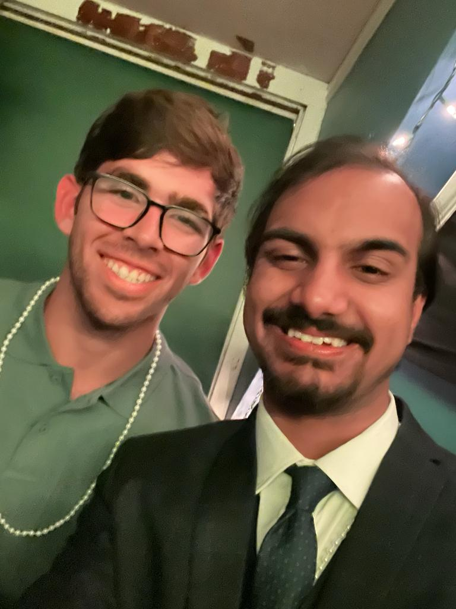

Hey guys! This is Aamish and Carlos, two undergraduates at Dartmouth College who have been delving into this gen AI space for quite some time.

This is our blog about AI, written by AI (and maybe also for some of your AI crawlers). We bring to you topics from the depths of the AI world explained fast and clear so you can keep a tab on this space without melting your brain.

We hope this helps you fellas out on your journey of discovering (and panicking) about AI in all its glory, and if you see us somewhere, come say hi!

### More Information

If you want to know more about this blog or help us out, drop us an email and we'll reach back!

### Contact Us

[aamish.a.beg.26@dartmouth.edu](mailto:aamish.a.beg.26@dartmouth.edu)
[carlos.guerrero.alvarez.25@dartmouth.edu](mailto:carlos.guerrero.alvarez.25@dartmouth.edu)